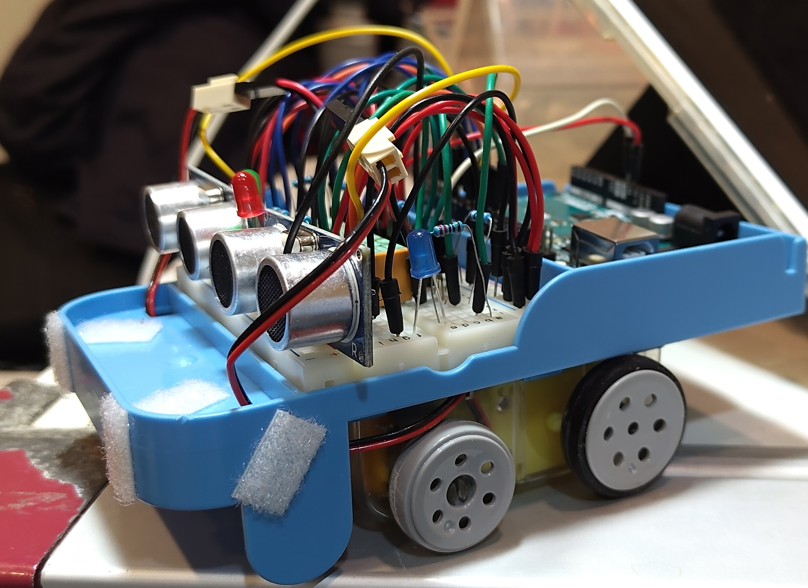
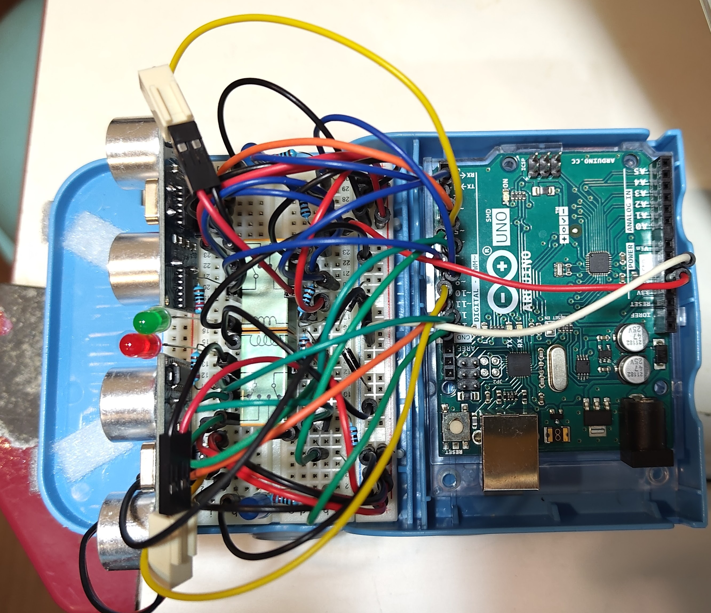
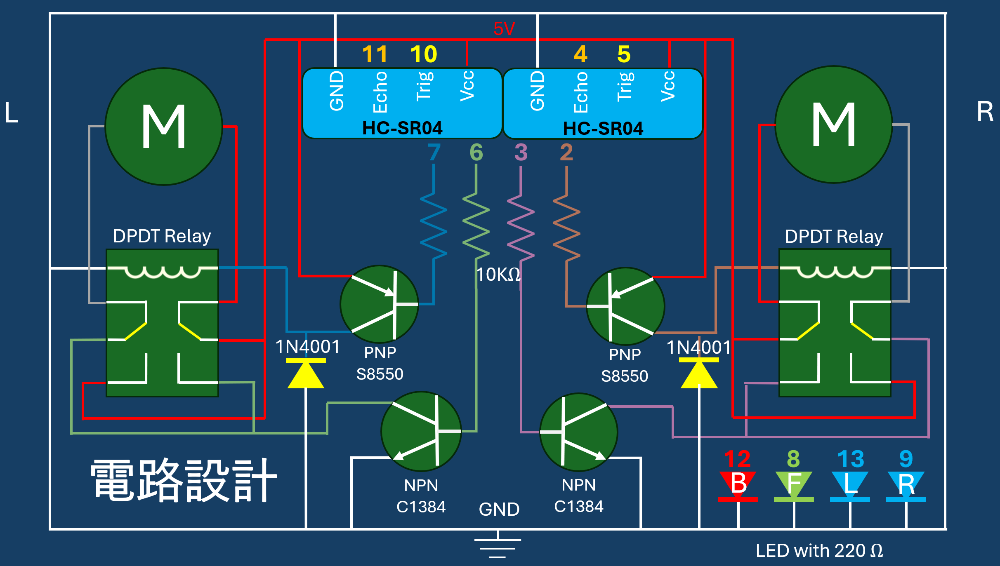

# CSL Ultrasonic Car (Discrete H-Bridge Control)

> **Course Project:** Control System Lab (CSL)
> **Institution:** National Taipei University of Technology (NTUT), Dept. of Electrical Engineering
> **Semester:** 114-1 (2025 Autumn)
> **Author:** Annie Huang (第一組 111310452)





## Project Overview

This project implements a **closed-loop control autonomous vehicle** capable of object tracking and distance maintenance using ultrasonic feedback.

Unlike typical Arduino projects that rely on pre-made motor driver modules (e.g., L298N), this project features a **custom-designed H-Bridge driver** built from discrete components (BJTs and Relays). This approach demonstrates a deep understanding of low-level hardware control, current paths, and back-EMF protection.

## Key Features



### 1. Hardware: Discrete Component H-Bridge

Instead of using integrated driver ICs, the motor driver is hand-crafted to isolate control logic from power actuation:

- **Direction Control:** Implemented using **S8550 (PNP)** transistors driving **DPDT Relays**.
- **Speed Control:** Implemented using **2SC1384 (NPN)** power transistors for PWM low-side switching.
- **Protection:** Integrated **1N4001 Flyback Diodes** to absorb inductive kickback from relays.

### 2. Software: Robust Signal Processing

To handle the noisy data typical of low-cost ultrasonic sensors:

- **Median Filter:** Implemented a bubble-sort algorithm to sample 5 readings and pick the median, effectively eliminating outliers (spikes).
- **Deadband Control:** defined a tolerance range () to prevent motor oscillation (chattering) when the target distance is reached.
- **Dual-Layer Logic:**
- **Spot Turn:** For large errors, the car rotates in place.
- **Differential Drive:** For small errors, the car adjusts wheel speeds individually for smooth correction.

## Hardware Architecture

### Bill of Materials (BOM)

| Component  | Specification     | Quantity | Function                                   |
| ---------- | ----------------- | -------- | ------------------------------------------ |
| Controller | Arduino Uno       | 1        | Central Processing Unit                    |
| Sensor     | HC-SR04           | 2        | Ultrasonic Distance Measurement            |
| Transistor | **S8550 (PNP)**   | 2        | High-side Switch (Relay Driver)            |
| Transistor | **2SC1384 (NPN)** | 2        | Low-side Switch (PWM Speed Control)        |
| Relay      | DPDT (5V)         | 2        | Motor Direction Reversal                   |
| Diode      | **1N4001**        | 2        | Flyback/Back-EMF Protection                |
| Motor      | DC Gear Motor     | 2        | Drive Train                                |
| LED        | Red/Green/Blue    | 4        | State Indication (Forward/Back/Left/Right) |

### Circuit Design

The system isolates the MCU control signals from the motor power supply.

- **Pin 2/7 (Digital):** Controls S8550 -> Relay (Direction).
- **Pin 3/6 (PWM):** Controls C1384 (Speed).
- **Pin 4/5 & 10/11:** HC-SR04 Trigger/Echo.

## Software Logic

The core control loop runs in `ultrasonic_control_motor.ino`:

1. **Sensing:** Read raw data from Left/Right HC-SR04 sensors.
2. **Filtering:** Apply Median Filter to remove noise.
3. **Error Calculation:**

- `Diff = Left_Dist - Right_Dist` (Orientation Error)
- `Dist_Err = Target - Current_Dist` (Position Error)

4. **Decision Making:**

- **Case 1: Large Orientation Error:** Trigger Spot Turn.
- **Case 2: Distance Error > Tolerance:** Move Forward/Backward with Differential Steering.
- **Case 3: Within Deadband:** Stop motors (AnalogWrite 0).

## File Structure

```text
.
├── ultrasonic_control_motor.ino  # Main Arduino Source Code
├── test_relay.ino  # Testing Relay Function
├── test_ultra_sound.ino  # Testing Ultrasonic Sensor Function
├── circuit_diagram.png           # Hardware Schematic
└── README.md                     # Project Documentation

```

## How to Run

1. Clone this repository.
2. Open `ultrasonic_control_motor.ino` in Arduino IDE.
3. Verify the pin definitions match your wiring (defined in the top of the file).
4. Upload to Arduino Uno.
5. Open Serial Monitor (9600 baud) to view real-time distance data and filter performance.

## License

This project is open-source for educational purposes.

---

_Created by Annie Huang, NTUT EE._
